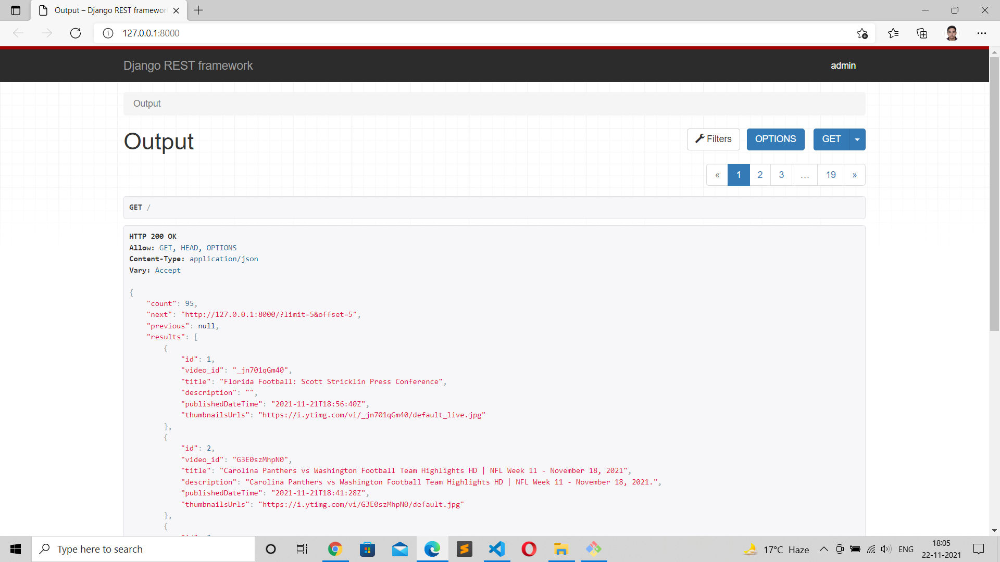
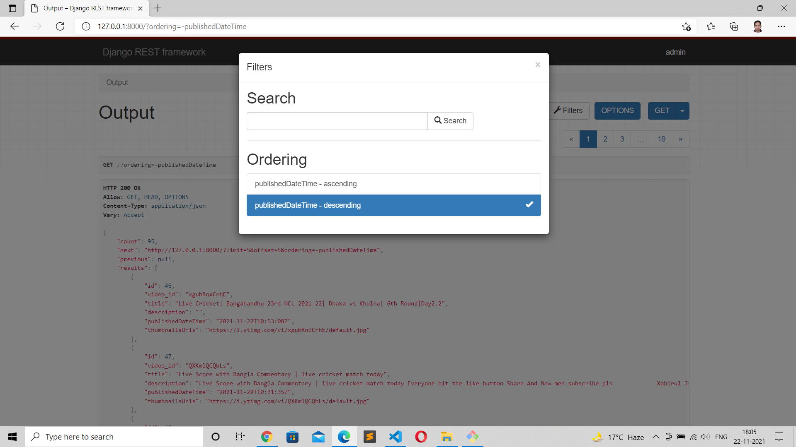
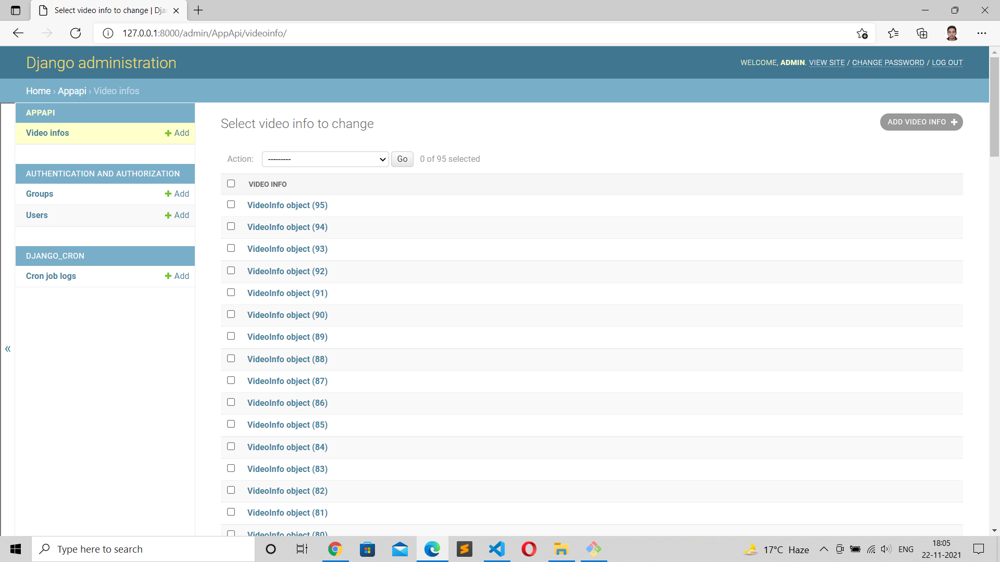
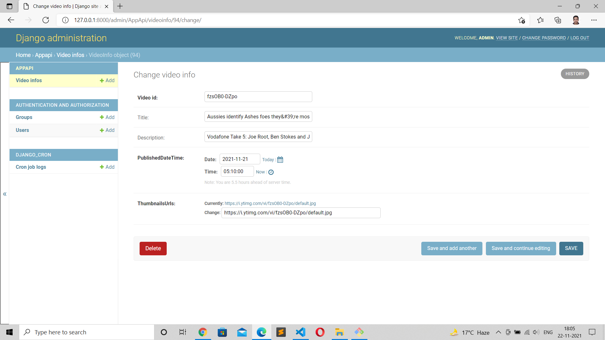

# TASK
To make an API to fetch latest videos sorted in reverse chronological order of their publishing date-time from YouTube for a given tag/search query in a paginated response.
# Basic Requirements:
- Server should call the YouTube API continuously in background (async) with some interval (say 10 seconds) for fetching the latest videos for a predefined search query and should store the data of videos (specifically these fields - Video title, description, publishing datetime, thumbnails URLs and any other fields you require) in a database with proper indexes.
- A GET API which returns the stored video data in a paginated response sorted in descending order of published datetime.
- A basic search API to search the stored videos using their title and description

# How to Run?
1. Clone the project
2. Install all dependencies required by the project using typing pip install -r requirements.txt in the terminal
3. Get the YOUTUBE_DATA_API_KEY from https://developers.google.com/youtube/v3/getting-started and place it in settings.py file
4. Setup crontab to run Job https://django-cron.readthedocs.io/en/latest/introduction.html for calling the YOUTUBE API repeatedly
5. Run the server using python mange.py runserver

# ScreenShots

